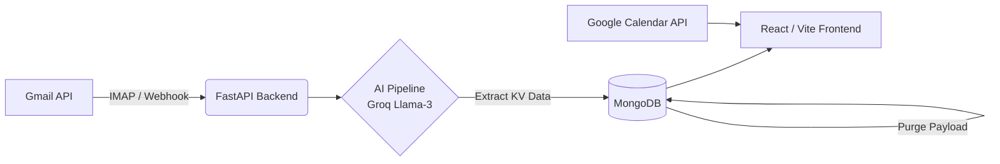

<div align="center">
  

  # ⚡ Nexus Mail

  **The AI-Powered Open Source Email Workspace.**<br>
  *A privacy-first, zero-data retention command center for your inbox.*

  <br>
  <b><a href="https://github.com/Jaswanth-K1210/Nexus-Mail/blob/main/demo.mov">▶️ Click here to watch the Demo Video</a></b>
  <br><br>

  [](https://opensource.org/licenses/MIT)
  [](https://fastapi.tiangolo.com/)
  [](https://reactjs.org/)
  [](https://groq.com/)
  [](http://makeapullrequest.com)

  [Features](#sparkles-features) •
  [Architecture](#triangular_ruler-architecture) •
  [Quickstart](#rocket-quickstart) •
  [Contributing](#handshake-contributing) •
  [SaaS & Enterprise](#office-b2b-saas--enterprise)
</div>

<br>

<p align="center">
  Nexus Mail is an open-source alternative to expensive AI email wrappers. It plugs directly into your Gmail account and uses lightning-fast LLMs (Groq / Llama-3) to mathematically triage your emails, extract action items, and build a cohesive timeline of your deadlines and meetings—all while strictly enforcing a <b>Zero-Data Retention</b> policy to protect your privacy.
</p>

## :sparkles: Features

- 🧠 **AI Priority Triage:** Automatically scores and splits emails into a "Priority Inbox" (investors, clients, team) and "Other Inbox" (receipts, newsletters).
- ⏱️ **Mail Specialist Timeline:** Extracts deadlines and action items directly from email bodies and merges them with your upcoming Google Calendar events.
- 💨 **Sub-Second AI via Groq:** Uses highly-optimized plain-text KV extraction prompts to process incoming emails with < 1s latency at a fraction of standard JSON LLM token costs.
- 🛡️ **Zero-Data Retention Policy:** Aggressively drops HTML/Text payloads from the database the moment AI processing concludes. Keep the intelligence, drop the bulk.
- 🤖 **Draft-First Capabilities:** Automatically generate warm, contextual replies to meeting invites and standard emails using your custom tone profile.

---

## :triangular_ruler: Architecture

Nexus Mail is built on a modern, highly scalable stack optimized for easy self-hosting or scalable enterprise deployment.



### Stack
* **Frontend:** React, Vite, Tailwind CSS, Lucide Icons
* **Backend:** Python, FastAPI, Motor (Async MongoDB), Celery / Redis (Optional scaling)
* **Database:** MongoDB
* **AI Provider:** Groq (Llama-3 8b/70b highly recommended for speed), OpenAI fallback

---

## :rocket: Quickstart

You can run Nexus Mail locally on your machine in under 5 minutes.

### 1. Clone the repository
```bash
git clone https://github.com/Jaswanth-K1210/Nexus-Mail.git
cd nexus-mail
```

### 2. Backend Setup
```bash
cd backend
python3 -m venv .venv
source .venv/bin/activate
pip install -r requirements.txt

# Copy environment variables and fill them in
cp .env.example .env

# Run the backend
uvicorn app.main:app --host 127.0.0.1 --port 8000 --reload
```
*Note: You will need a Google Cloud Project Client ID/Secret, and a [Groq API Key](https://console.groq.com).*

### 3. Frontend Setup
```bash
cd frontend
npm install
npm run dev
```

Your completely private AI assistant is now running at `http://localhost:5173`.

---

## :office: The Architecture of Empathy & Open Source

Nexus Mail has formally pivoted away from a massive B2B SaaS architecture and is now built entirely as a **Free, Open-Source, Bring-Your-Own-Key (BYOK)** platform. We believe AI should fundamentally ease the cognitive overload of the working class, not act as a premium enterprise barrier.

To understand why we abandoned the SaaS model in favor of a privacy-first, zero-data local database architecture for Corporate Employees, Independent Operators, and Field Workers, please read our [Open Source Manifesto](OPEN_SOURCE_MANIFESTO.md).

---

## :handshake: Contributing

Nexus Mail is entirely community-driven! We are trying to build the ultimate open-source email assistant. 

Read our [Contributing Guidelines](CONTRIBUTING.md) to learn how you can submit Pull Requests.
* **Good first issues:** UI refinements, adding support for Outlook/Microsoft Graph API, or refining AI prompts.

## :scroll: License

This project is licensed under the [MIT License](LICENSE). 

<div align="center">
  <b>If you love privacy-first AI, please give us a ⭐️ on GitHub!</b>
</div>
