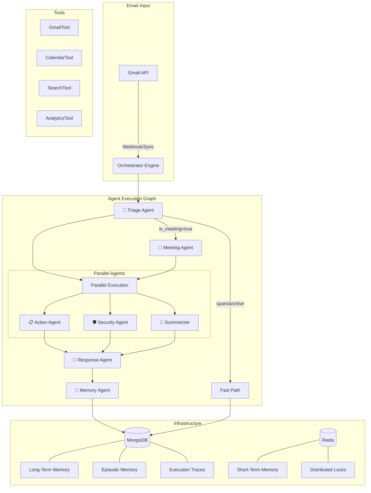

<div align="center">
  

  # ⚡ Nexus Mail

  **Autonomous Multi-Agent Email Intelligence Platform**<br>
  *Production-grade agentic AI system with LangGraph-inspired orchestration, multi-tier memory, tool abstraction, and autonomous email operations.*

  <br>
  <b><a href="https://github.com/Jaswanth-K1210/Nexus-Mail/blob/main/demo.mov">▶️ Click here to watch the Demo Video</a></b>
  <br><br>

  [](https://opensource.org/licenses/MIT)
  [](https://fastapi.tiangolo.com/)
  [](https://reactjs.org/)
  []()
  [](https://groq.com/)
  [](http://makeapullrequest.com)

  [Architecture](#-multi-agent-architecture) •
  [Agents](#-agent-system) •
  [Features](#-features) •
  [Quickstart](#-quickstart) •
  [AI Infrastructure](#-ai-infrastructure)
</div>

<br>

> **Nexus Mail** is an autonomous email operations platform that deploys **7 specialized AI agents** through a **LangGraph-inspired stateful execution graph** to classify, analyze, and act on incoming emails. The system features multi-tier memory (short-term, long-term, episodic, semantic), tool-augmented agents, production-grade observability, and autonomous workflow capabilities — all while enforcing a strict zero-data retention privacy policy.

---

## 🏗️ Multi-Agent Architecture

Nexus Mail transforms email processing from a monolithic pipeline into a production-grade multi-agent orchestration system.


```mermaid
graph TB
    subgraph "Email Input"
        A[Gmail API] -->|Webhook/Sync| B(Orchestrator Engine)
    end
    
    subgraph "Agent Execution Graph"
        B --> C[🎯 Triage Agent]
        C -->|"is_meeting=true"| D[📅 Meeting Agent]
        C -->|"spam/archive"| J[Fast Path]
        C --> E[Parallel Execution]
        D --> E
        
        subgraph "Parallel Agents"
            E --> F[📋 Action Agent]
            E --> G[🛡️ Security Agent]
            E --> H[📝 Summarizer]
        end
        
        F & G & H --> I[💬 Response Agent]
        I --> K[🧠 Memory Agent]
    end
    
    subgraph "Infrastructure"
        L[(MongoDB)] --- M[Long-Term Memory]
        L --- N[Episodic Memory]
        L --- O[Execution Traces]
        P[(Redis)] --- Q[Short-Term Memory]
        P --- R[Distributed Locks]
    end
    
    subgraph "Tools"
        S[GmailTool]
        T[CalendarTool]
        U[SearchTool]
        V[AnalyticsTool]
    end
    
    K --> L
    J --> L
```

### Agent Execution Flow

```
START → Triage Agent → Conditional Router
                        ├─ Meeting detected → Meeting Intelligence Agent
                        ├─ Spam/auto-archive → Fast path (skip heavy agents)
                        └─ Standard → Parallel execution
                        
Parallel: Action Agent ║ Security Agent ║ Summarizer
                        ↓
Response Agent → Memory Agent → Persist → END
```

Each agent produces:
- **Structured output** — typed, validated results
- **Reasoning trace** — chain-of-thought decision explanation
- **Confidence score** — how certain the agent is
- **Tool invocation log** — which tools were used and their latency
- **Execution telemetry** — tokens, latency, retry count

---

## 🤖 Agent System

### 1. Inbox Triage Agent (`triage_agent`)
| Capability | Description |
|-----------|-------------|
| Email Classification | 8+ categories with role-specific classification (15+ categories for specialized roles) |
| Priority Scoring | 5-signal algorithm: sender relationship (30%) + content urgency (25%) + category (20%) + recency (15%) + behavior (10%) |
| Sender Intelligence | VIP detection, cold sender analysis, relationship strength scoring |
| Reasoning | Produces structured decision log: *"High-priority from VIP sender → category 'important'"* |

### 2. Meeting Intelligence Agent (`meeting_agent`)
| Capability | Description |
|-----------|-------------|
| Calendar Reasoning | Checks Google Calendar for conflicts with 15-min buffer |
| Conflict Detection | FREE / PARTIAL / BUSY status with conflict details |
| Meeting Extraction | AI-powered extraction of datetime, timezone, platform, duration |
| Confidence Gating | Below-threshold meetings are auto-dismissed |

### 3. Action Extraction Agent (`action_agent`)
| Capability | Description |
|-----------|-------------|
| Task Extraction | Structured action items with priority, deadline, and type |
| Dependency Detection | Links related tasks across emails |
| Follow-Up Tracking | Identifies missing replies and stale threads |

### 4. Security Review Agent (`security_agent`)
| Capability | Description |
|-----------|-------------|
| Phishing Detection | AI-powered analysis with confidence scoring |
| Social Engineering | Pattern detection for manipulation tactics |
| Sender Reputation | Cross-references with long-term sender memory |
| Risk Escalation | Human-in-the-loop checkpoint for high-confidence threats |

### 5. Response Generation Agent (`response_agent`)
| Capability | Description |
|-----------|-------------|
| Auto-Reply | Autonomous replies for low-priority emails using tone profile |
| Corporate Shield | Hyper-professional protocol for VIP/high-priority senders |
| Meeting Drafts | Dual accept/decline drafts for meeting invitations |
| Tone Adaptation | Passive learning from user's sent emails |

### 6. Communication Memory Agent (`memory_agent`)
| Capability | Description |
|-----------|-------------|
| Relationship Persistence | Stores sender interaction history for future decisions |
| Episode Storage | Records past agent decisions for pattern recall |
| Thread Summaries | Compressed conversation context for response continuity |
| Task Tracking | Persists unresolved high-priority action items |

### 7. Workflow Orchestrator
| Capability | Description |
|-----------|-------------|
| Stateful Graph | LangGraph-inspired conditional routing with state transitions |
| Parallel Execution | Independent agents run concurrently for latency optimization |
| Retry + Fallback | Automatic retry-with-reflection on agent failure |
| Human Checkpoints | Approval gates for high-risk autonomous actions |

---

## ✨ Features

### Autonomous Workflows
- 🧹 **Inbox Cleanup** — Auto-archive newsletters from never-read senders, auto-prioritize VIPs
- 📅 **Meeting Handling** — Conflict detection, availability-based response suggestions
- 📬 **Follow-Up Management** — Detect stale threads, generate reminders, escalate important emails
- 🤖 **Auto-Reply** — AI-crafted acknowledgements for low-priority emails matching user's tone

### Intelligence
- 🧠 **Multi-Tier Memory** — Short-term (Redis), Long-term (MongoDB), Episodic (past decisions), Semantic (thread summaries)
- 🔍 **Reasoning Traces** — Every agent decision explained with chain-of-thought reasoning
- 📊 **5-Signal Priority** — Behavioral velocity + LLM classification + sender relationship
- 🎯 **Role-Aware Classification** — 15+ categories per specialized professional role

### Infrastructure
- 📈 **Execution Tracing** — OpenTelemetry-compatible span-based tracing for every workflow
- 🔧 **Tool Abstraction** — 6 structured tools (Gmail, Calendar, Draft, Search, Analytics, ThreadContext)
- 🔄 **Circuit Breaker** — Automatic failover across 3 AI providers (Ollama → Groq → OpenRouter)
- 🔒 **Zero-Data Retention** — AES-256 encrypted tokens, 30-day TTL on email data

---

## 🔬 AI Infrastructure

### Orchestration Runtime
```
backend/app/
├── agents/              # 7 specialized AI agents with reasoning traces
│   ├── base.py          # BaseAgent with telemetry, retry, reflection
│   ├── state.py         # WorkflowState (LangGraph-inspired typed state)
│   ├── registry.py      # Dynamic agent registration + DI
│   ├── triage_agent.py
│   ├── meeting_agent.py
│   ├── action_agent.py
│   ├── security_agent.py
│   ├── response_agent.py
│   └── memory_agent.py
├── orchestrator/        # Stateful execution graph
│   └── graph.py         # EmailProcessingGraph with conditional routing
├── tools/               # Tool abstraction layer
│   ├── base.py          # BaseTool with structured I/O + retries
│   └── implementations.py  # Gmail, Calendar, Draft, Search, Analytics tools
├── memory/              # Multi-tier memory system
│   └── store.py         # Short-term (Redis) + Long-term + Episodic + Semantic
├── telemetry/           # Observability
│   └── tracer.py        # Execution tracing, metrics, decision logging
├── ai_worker/           # AI provider layer (preserved)
│   ├── ai_provider.py   # 3-tier provider with circuit breaker
│   ├── pipeline.py      # Orchestrator integration with legacy fallback
│   └── tasks/           # AI prompt implementations (wrapped by agents)
├── services/            # Business logic (wrapped by tools)
├── routes/              # API endpoints including /api/agents/*
└── core/                # Config, DB, Redis, Security
```

### Observability Stack

| Metric | Storage | Retention |
|--------|---------|-----------|
| Execution Traces | MongoDB `execution_traces` | 30 days |
| Agent Metrics | MongoDB `agent_metrics` | Permanent |
| Decision Logs | MongoDB `agent_decisions` | Permanent |
| Tool Metrics | MongoDB `tool_metrics` | Permanent |
| Agent Memory | MongoDB `agent_memory` | Permanent |
| Episodic Memory | MongoDB `agent_episodes` | 90 days |

### API Endpoints

```
GET  /api/agents/registry          # List all agents and capabilities
GET  /api/agents/metrics            # Agent execution metrics (daily)
GET  /api/agents/decisions          # Agent decision logs
GET  /api/agents/traces             # Recent execution traces
GET  /api/agents/traces/{trace_id}  # Full trace detail with spans
GET  /api/agents/memory/{sender}    # Sender memory and episodes
```

---

## 🚀 Quickstart

### 1. Clone the repository
```bash
git clone https://github.com/Jaswanth-K1210/Nexus-Mail.git
cd nexus-mail
```

### 2. Backend Setup
```bash
cd backend
python3 -m venv .venv
source .venv/bin/activate
pip install -r requirements.txt

# Copy environment variables and fill them in
cp .env.example .env

# Run the backend
uvicorn app.main:app --host 127.0.0.1 --port 8000 --reload
```
*Note: You will need a Google Cloud Project Client ID/Secret, and a [Groq API Key](https://console.groq.com).*

### 3. Frontend Setup
```bash
cd frontend
npm install
npm run dev
```

Your autonomous AI email platform is now running at `http://localhost:5173`.

### 4. Docker Deployment (Production)
```bash
docker compose up -d --build
```

---

## 🏛️ Design Philosophy

Nexus Mail's agent architecture is inspired by:

| System | Inspiration |
|--------|------------|
| **LangGraph** | Stateful execution graphs with conditional routing and checkpoints |
| **CrewAI** | Specialized agent roles with defined responsibilities |
| **OpenAI Agents SDK** | Tool-augmented agents with structured outputs |
| **AutoGen** | Multi-agent conversation and delegation patterns |
| **MCP Protocol** | Standardized tool interface abstraction |

### Key Design Decisions

1. **Agents wrap, not replace** — Battle-tested AI prompts are preserved; agents add reasoning, telemetry, and memory around them
2. **Tools wrap services** — Existing services become structured tools with tracing; no logic duplication
3. **Memory is additive** — New collections alongside existing ones; zero migration risk
4. **Graceful degradation** — Orchestrator falls back to legacy pipeline on failure

---

## 🤝 Contributing

Nexus Mail is entirely community-driven! Read our [Contributing Guidelines](CONTRIBUTING.md).

**Good first issues:** Implementing vector DB support for semantic memory, adding a trace visualization component, or extending the agent system with new capabilities.

## 📜 License

This project is licensed under the [MIT License](LICENSE).

<div align="center">
  <b>If you love autonomous AI systems, please give us a ⭐️ on GitHub!</b>
</div>
